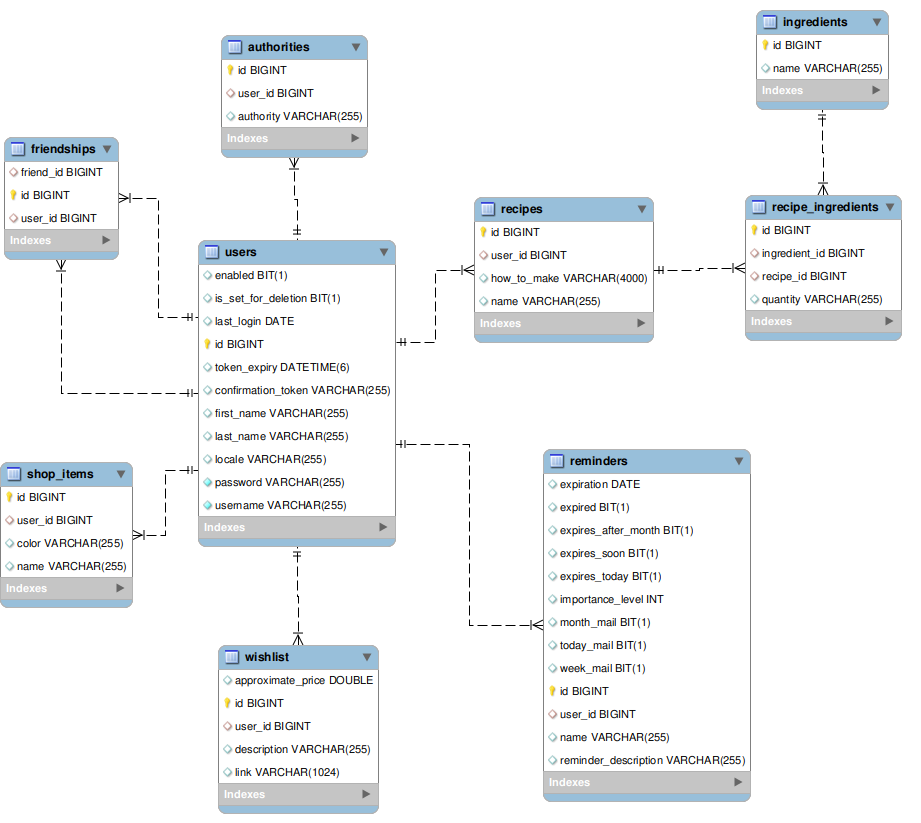

# belejki.rest

**belejki.rest** is a Spring Boot RESTful API that allows users to manage reminders, recipes, wishlists, shopping lists, and friendships. Each user can create and manage their personal data while optionally sharing wishlists with friends.

## ✨ Features

- **User Registration & Authentication** – Register, confirm via email, and log in securely.
- **Reminders** – Set reminders with expiration dates.
- **Recipes** – Store and retrieve cooking recipes.
- **Wishes** – Create wishlists with price estimates and item links.
- **Shopping List** – Manage personal shopping items.
- **Friendships** – Add friends and access their wishlists.

## ⚙️ Installation & Setup

### Requirements

- Java 17+
- Maven
- MySQL 8+
- IntelliJ IDEA (recommended)

### 📥 Clone the Repository

bash
git clone https://github.com/Valsinev/belejki.rest.git
cd belejki.rest

### ⚙️ Environment Variables
Before running the application, set the following environment variables:
| Variable                   | Description                                                     | Default            |
| -------------------------- | --------------------------------------------------------------- | ------------------ |
| `SERVER_PORT`              | (Optional) Port to run the app on                               | `8080`             |
| `APP_BASE_URL`             | (Optional) Base URL used in email confirmation links            | `http://localhost` |
| `DATABASE_URL`             | JDBC URL for MySQL (e.g. `jdbc:mysql://localhost:3306/belejki`) | —                  |
| `DATABASE_USER`            | MySQL username                                                  | —                  |
| `DATABASE_PASSWORD`        | MySQL password                                                  | —                  |
| `SPRING_SECURITY_USER`     | Default Spring Security username (for testing endpoints)        | —                  |
| `SPRING_SECURITY_PASSWORD` | Spring Security password                                        | —                  |
| `SPRING_MAIL_HOST`         | SMTP server host (e.g., `smtp.gmail.com`)                       | —                  |
| `SPRING_MAIL_USERNAME`     | Email address used to send emails                               | —                  |
| `SPRING_MAIL_PASSWORD`     | App-specific email password (for Gmail or similar)              | —                  |
| `JWT_SECRET`  | Your jwt secret string | `yourSuperSecretKeyForJWTSigning1234567890`|

💡 In IntelliJ, go to Run > Edit Configurations > Environment Variables to set these.

### 🛠️ Database Configuration
This project uses Spring Data JPA with Hibernate for ORM. You can create the database by changing this property in application.properties.
- spring.jpa.hibernate.ddl-auto=create

Or you can set up the database schema locally, use the provided SQL script.

### Step 1: Create a Database
- First, create a new MySQL database (e.g., `my_project_db`):

sql
CREATE DATABASE my_project_db;

### Ster 2: Run the Schema Script
Import the SQL script to create all tables and relationships.

- Option 1: Using MySQL Workbench
   Open MySQL Workbench
   Connect to your local MySQL server
   Open the script: File > Open SQL Script and select docs/init-database.sql
   Click the lightning bolt to execute the script

- Option 2: Using MySQL CLI
  mysql -u your_username -p my_project_db < docs/init-database.sql
  Replace your_username and my_project_db with your actual credentials and DB name

This setting controls how Hibernate handles your database schema at startup. Possible values:
| Value         | Description                                                          |
| ------------- | -------------------------------------------------------------------- |
| `none`        | No schema changes.                                                   |
| `create`      | Drops and recreates the database schema every run. ⚠️ Destroys data. |
| `update`      | Updates schema without data loss. ✅ Recommended for development.     |
| `validate`    | Validates schema matches entities. Fails if not.                     |
| `create-drop` | Same as `create`, but also drops on shutdown. ⚠️ Destroys data.      |

📌 JDBC URL Format
Make sure your JDBC URL follows this format:
jdbc:mysql://localhost:3306/belejki
- localhost – Your DB host
- 3306 – MySQL default port
- belejki – Schema name you must create manually
dont forget there is environment variable for the database url

### 🚀 Running the Application
✅ In IntelliJ (Recommended)

   1. Open the project in IntelliJ IDEA.

   2. Set environment variables (see above).

   3. Find the main class: Application.java.

   4. Right-click it and choose Run.

The API will start and be available at: http://localhost:8080/

🧪 From Terminal (Alternative)

./mvnw spring-boot:run

Or package and run the JAR:

./mvnw package
java -jar target/belejki.rest-0.0.1-SNAPSHOT.jar

Make sure environment variables are exported before running:

export DATABASE_URL=jdbc:mysql://localhost:3306/belejki
export DATABASE_USER=root
export DATABASE_PASSWORD=yourpassword
...

## 📫 API Documentation

## 📊 Database Schema

Here is the Entity-Relationship (ER) diagram for the database structure:

This project uses a Postman collection to document and test the REST API.

### ▶️ How to Use

1. **Download the collection file**:
   [📄 BelejkiApi.postman_collection.json](./docs/BelejkiApi.postman_collection.json)

2. **Import into Postman**:
    - Open Postman.
    - Click **"Import"** > **"File"**, and choose the JSON file above.

3. **Optional: Set up Environment**  
   To simplify testing, set up Postman environment variables (e.g. `base_url`, `jwtToken` etc.).

---

## 🛠️ Technologies Used

- Java 17

- Spring Boot

- Spring Data JPA

- Hibernate

- Spring Security

- Spring Mail

- MySQL

- Maven

- Postman

